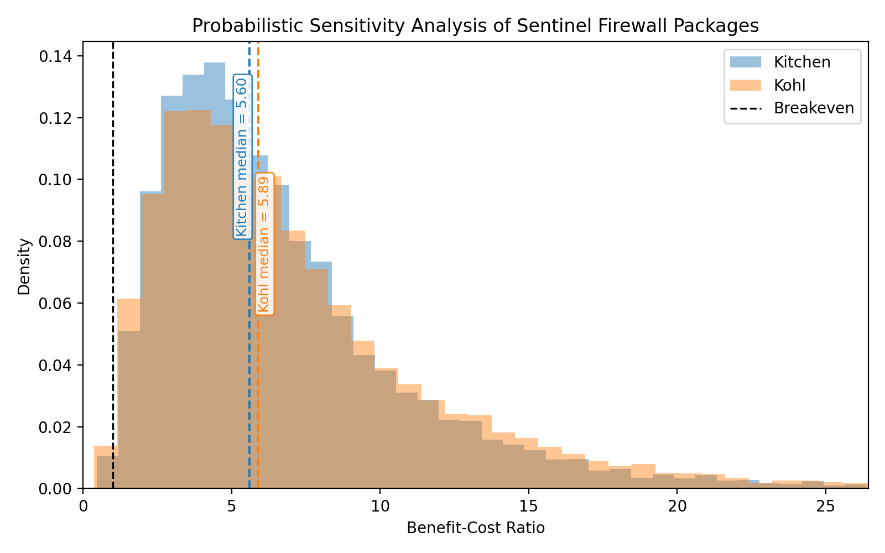

# The Sentinel Firewall: A Health-System Strategy to Decouple Informal Industrialization from Lead Exposure in LMICs

David I Levine

ORCID: 0000-0002-7210-5499

Haas School of Business, University of California, Berkeley, Berkeley,
California, USA

Correspondence to: Professor David I Levine; levine@berkeley.edu

## Abstract

Lead exposure remains an important and under-addressed driver of
neurodevelopmental and cardiovascular inequity in low- and middle-income
countries (LMICs). Much of the remaining burden now comes from informal
consumer products that households cannot easily identify and regulators
do not easily control, including artisanal cookware, traditional
cosmetics and lead-contaminated food-contact items. We propose a
Sentinel Firewall framework that identifies high-risk districts and
deploys safe-product packages through existing contacts during
pregnancy, birth and early childhood. We evaluate two packages: a
Kitchen Package consisting of a lead-safe pot voucher, calcium and safe
child utensils, and a Kohl Package consisting of safe maternal and
infant kohl substitutes. The model incorporates district fixed costs,
the duration and developmental timing of lead reduction from each new
product, maternal-fetal transfer of lead, and real-world implementation
losses from imperfect targeting, imperfect health-system fidelity and
incomplete safe-product use. The analysis is intended as an illustrative
decision model for settings where one or more hazardous consumer
products are common, rather than as a universal estimate for all LMICs.
We use a 10 000-draw probabilistic sensitivity analysis with PERT
distributions to simulate reductions in maternal and child blood lead,
child cognitive gains, maternal and neonatal health gains, adult
cardiovascular health gains and income gains. Both packages generate
median benefit-cost ratios greater than 4, and the 5th percentile of
the social benefit-cost ratio remains above parity in both packages.
The public spreadsheet and Python code allow ministries, NGOs and local
researchers to replace the illustrative assumptions with local data.
These findings support targeted pilot implementation of safe-product
substitution through maternal and child health systems while stronger
regulatory and industrial reforms are pursued.

## Summary box

### What is already known

- Lead exposure remains a major cause of neurodevelopmental loss and
  adult cardiovascular disease in LMICs.
- Important contemporary exposure routes often arise from informal
  consumer products such as artisanal metal cookware, traditional leaded
  cosmetics and lead-contaminated food-contact items.
- Pregnancy, infancy and early childhood are especially vulnerable
  windows because maternal lead can be mobilised during pregnancy and
  transferred to the fetus, while infants and young children absorb more
  ingested lead than adults.

### What are the new findings

- We propose a Sentinel Firewall framework that identifies high-risk
  districts or catchments and uses existing maternal and child health
  platforms to distribute safe-product substitutes targeted to locally
  identified hazards.
- We evaluate a Kitchen Package delivered through antenatal care and
  immunisation contacts, and a Kohl Package delivered through antenatal
  care plus either facility delivery or early-immunisation catch-up.
- In a 10 000-draw Monte Carlo simulation, both packages have median
  benefit-cost ratios above parity, but the Kitchen Package is more
  robust and the Kohl Package has a wider lower tail.
- The model is designed as a transparent local-adaptation tool: users
  can replace the illustrative LMIC hotspot assumptions with local
  prevalence, cost, uptake and blood lead response data.

### What do the new findings imply

- Health ministries may be able to reduce lead exposure during the
  highest-risk life stages by integrating targeted safe-product
  replacement into existing maternal and child health contacts.
- Sentinel screening and voucher-linked substitution can provide
  immediate risk reduction while generating intelligence about where to
  target enforcement and producer upgrading.
- Because almost all parameters remain uncertain, pilot programmes
  should prioritise measurement of product prevalence, redemption,
  sustained use, residual unsafe use and measured blood lead response.
- The spreadsheet and Python code are intended to help ministries, NGOs
  and local researchers test whether substitution appears cost-effective
  in their own regions before scaling.

# The crisis of informal exposure

Lead exposure in LMICs increasingly reflects a regulatory mismatch.
Although the long-term goal should be to remove lead from the global
economy, millions of tonnes of lead continue to circulate through
mining, manufacturing, recycling and informal supply chains, with harms
falling disproportionately on LMICs.1 After the phase-out of leaded
gasoline, a larger share of the remaining burden now comes from the
"last mile" of lead exposure: ordinary consumer products that
households use every day, but that regulators do not easily observe or
control. These include artisanal cookware cast from mixed scrap,
traditional eye cosmetics such as kohl or surma, and ceramics or other
food-contact goods containing lead. WHO identifies cosmetics, ceramic
glazes, toys, traditional medicines, paint and contaminated food or
water as continuing sources of lead exposure, while recent rapid market
screening across 25 LMICs found frequent contamination in metal
foodware, ceramics, paints and cosmetics.2,3

These products may be widely trusted, culturally embedded and difficult
for households to distinguish from safer alternatives. Because lead
toxicity is almost always invisible in the short run, households receive
no immediate warning signal that would trigger avoidance. But low
visibility does not imply low importance: WHO estimates that lead
exposure caused more than 1.5 million deaths in 2021, primarily through
cardiovascular disease, and substantial disability worldwide.2

The regulatory mismatch matters especially during pregnancy and early
childhood. Lead stored in bone can be released into blood during
pregnancy and become a source of fetal exposure. Infants and young
children are also more vulnerable because they absorb more ingested lead
than adults and because the developing brain is highly sensitive to
toxic injury.2 These overlapping pathways mean that a practical
lead-control strategy in many LMIC settings must do two things at once:
identify local exposure clusters and protect households during the life
stages when developmental harm is largest.

## Three tractable exposure pathways

The relative importance of lead sources varies across regions, but three
consumer-product pathways illustrate a broader pattern of informally
produced, weakly regulated goods that can generate large exposure in
specific communities.

First, artisanal aluminium cookware can leach lead into food when pots
are cast from mixed scrap containing leaded materials. Studies of metal
cookware in Cameroon and other settings show that lead can leach from
artisanal aluminium pots at levels capable of producing substantial
dietary exposure.4,5 Second, lead-contaminated cups, mugs, bowls and
spoons can increase chronic ingestion among infants and toddlers once
complementary feeding begins. The parameterisation in this paper treats
this pathway as plausible but less directly measured than the cookware
pathway, drawing on the broader literature on lead-contaminated foodware
and lead-glazed ceramics.3,6 Third, traditional eye cosmetics such as
kohl, kajal or surma often begin in the neonatal period for perceived
protective, ritual or health reasons. These products can contain very
high lead concentrations, and clinical and surveillance reports document
exposure among mothers and children.3,7

The three sources are attractive targets for policy because substitutes
exist. Unlike diffuse ambient contamination, contaminated cookware,
foodware and kohl can in principle be replaced quickly if safe
alternatives are culturally acceptable and governments can create
credible supply chains for safe products.

## Pregnancy as a window of vulnerability and opportunity

Pregnancy is both a biological vulnerability and a programmatic
opportunity. Lead stored in maternal bone can be mobilised during
pregnancy and lactation, and maternal blood lead is strongly related to
fetal exposure. Nutritional deficits, especially low calcium intake, can
worsen this process by increasing mobilisation or absorption of lead;
calcium supplementation during pregnancy has been shown in a randomised
trial to reduce maternal blood lead levels.2,8 Antenatal care (ANC)
reaches a large share of pregnant women in many LMICs, and health
systems already use ANC contacts to provide counselling, supplements and
referrals.9 Routine immunisation visits create an additional platform
for reaching infants when complementary feeding begins and child
exposure pathways expand.10,11 Facility delivery is another possible
contact for newborn interventions, but delivery and immunisation
contacts are correlated rather than independent. The model therefore
treats infant kohl delivery as occurring through the union of facility
delivery or early-immunisation catch-up.

# The Sentinel Firewall framework

We propose a Sentinel Firewall framework in which maternal and child
health services act as a temporary consumer-protection layer while
environmental enforcement and producer upgrading catch up. First,
districts or subdistricts with evidence of concentrated product
contamination are identified through sentinel screening, including
market sweeps, rapid field screening of high-risk goods, clinic-linked
intelligence and, where feasible, sentinel child blood lead monitoring.
Rapid market screening with X-ray fluorescence has already been used
across 25 LMICs to identify contaminated consumer products and foodware
categories that could plausibly guide local prioritisation.3

Second, when a district or catchment is flagged, health contacts trigger
modular intervention packages targeted to the locally dominant exposure
routes. Third, the programme closes the loop by feeding information from
product replacement and biomonitoring back into enforcement. If sentinel
sweeps, voucher redemption or surrendered products repeatedly identify
specific hazardous goods or supply chains, those data can help
prioritise enforcement and producer conversion to safe products.

The Sentinel Firewall is not a substitute for structural lead control.
It is an emergency harm-reduction strategy designed to buy time, protect
the most vulnerable groups and generate actionable intelligence to
reduce the supply of products containing lead.

## The safe-products packages

We evaluate two intervention packages. The Kitchen Package includes a
voucher distributed through ANC for a lead-safe cooking pot, calcium
delivered through ANC and safe child utensils delivered at infant
immunisation visits. The package is designed to protect the pregnant
woman, reduce fetal exposure through lower maternal blood lead and lower
direct child exposure after birth.

The Kohl Package includes safe maternal kohl delivered through ANC and
safe infant kohl delivered through either facility delivery or
early-immunisation catch-up. The main model allows infant kohl exposure
among boys as well as girls, because clinical evidence and programme
logic suggest that neonatal and first-year use can affect both sexes
even where use persists longer among girls in some settings.7 A
robustness check restricts infant kohl substitution to girls only.
The prevalence parameters for kohl should therefore be interpreted as
conditional on screened hotspot settings rather than as unconditional
regional averages.

# Economic model

The model asks a simple policy question: if a health system uses
maternal and child health contacts to replace leaded products with safer
substitutes in high-risk districts, are the resulting social gains
likely to exceed programme costs? The paper has two linked
contributions. First, it demonstrates what follows when plausible LMIC
values are applied to settings where hazardous cookware, kohl or child
feeding items are common. Second, it provides a transparent tool that
local analysts can adapt with their own prevalence, cost, uptake and
blood-lead data. The purpose is therefore not to estimate one global
benefit-cost ratio for all LMICs, but to make the assumptions and
uncertainty structure explicit enough for local decision-making. We
answer that question by linking each package to changes in blood lead,
then translating those reductions into child cognitive gains, maternal
and neonatal health gains, and adult cardiovascular gains (see Figure 1
for the main cognitive pathway).

> Note: IQ gains depend on the size, duration and developmental timing
> of fetal and child BLL reductions. Safe pots and calcium can lower
> maternal BLL during pregnancy and lactation, reducing fetal and
> breastmilk-mediated infant exposure. Safe pots and child utensils can
> also reduce postnatal exposure once complementary feeding begins.

The primary economic channel is child cognition. For each simulated
mother-child pair, we estimate the present value of lifetime earnings
from birth using a market-labour productivity anchor equal to PPP GDP
per capita multiplied by labour's share of national income, combined
with survival to adulthood and the end of working life, expected real
income growth and a social discount rate. This follows the social
benefit-cost tradition of valuing cognitive gains at their marginal
product rather than at observed wage rates, which would miss
own-account and informal production that remain important in the
settings modelled here. Household production, subsistence output not
captured in national accounts and the intrinsic value of cognition
beyond earnings are excluded, making this earnings channel conservative
on those dimensions.12-14 To reflect wide uncertainty across plausible
LMIC settings, these macroeconomic inputs are assigned ranges rather
than point values: PPP GDP per capita ranges from US\$2000 to US\$8000
with a mode of US\$4000, the labour-share parameter ranges from 0.50 to
0.58 with a mode of 0.55, real productivity growth has a mode of 2%,
and the social discount rate has a mode of 3%.12-14

We convert child blood lead reduction into IQ gain using a linear
parameter of 0.20-0.60 IQ points per 1 ug/dL reduction in
developmentally averaged child blood lead, with a mode of 0.35. This is
a practical approximation to a nonlinear literature showing cognitive
harm at blood lead levels below 10 ug/dL and larger marginal harm at
lower levels.15-18 A recent LMIC learning synthesis provides an
additional check that lead exposure is meaningfully associated with
lower learning outcomes in developing-country settings.19

We map IQ gains into lifetime earnings using an LMIC-centred return of
0.0030-0.0100 per IQ point, with a mode of 0.0050. This range is
intended to be policy-conservative: the lower bound allows for
substantial labour-market friction in subsistence-heavy settings, the
mode uses the lower end of lead valuation estimates, and the upper
bound is aligned with developing-country cognitive-skill estimates
while avoiding higher US-based values.20-23

The model distinguishes direct child lead reductions from prenatal
reductions mediated through the mother. In the Kitchen Package, the safe
pot and safe utensils reduce direct child exposure, while the safe pot
and calcium reduce maternal blood lead during pregnancy. In the Kohl
Package, maternal kohl affects prenatal exposure and infant kohl affects
direct child exposure after birth. To reflect placental transfer,
maternal blood lead reductions during pregnancy are converted into fetal
lead reductions using a fetal-transfer parameter with a mode of 0.80.
The parameter is motivated by the strong relationship between maternal
and cord blood lead and by evidence that reducing maternal blood lead
during pregnancy can lower fetal exposure.2,8,24,25

The cognition model does not treat a short prenatal or one-year infant
intervention as if it reduced average blood lead by the same amount
across all formative years. Instead, it assigns explicit developmental
shares that sum to one: 20%-40% of cognitive harm in the last four
months in utero, with a mode of 30%; 20%-40% in year 1, with a mode of
30%; and the remaining 30%-60% in years 2-5, with a mode of 40%. This
timing adjustment is motivated by evidence linking cognition to
prenatal, infancy and repeated early-childhood exposure histories rather
than to a single brief exposure interval.17,18,26

The most influential biological efficacy inputs are deliberately
assigned wide ranges when the literature is indirect. Among households
that use hazardous cookware and then switch fully to the safe pot for
food consumed by the pregnant woman or young child, the postnatal child
BLL reduction is modelled as 2-8 ug/dL, with a mode of 5. A full
switch means that the household starts with the unsafe product, receives
or redeems the safer substitute, and uses the safe product for the
target user without enough continued unsafe-product use to preserve the
original exposure pathway. The cookware child parameter is defined as
the postnatal child effect only; any prenatal child benefit from lower
maternal lead is modelled separately through the maternal pot pathway
and fetal transfer. The calcium parameter is anchored more tightly
because it is informed by a randomised trial in pregnancy: 0.5-2 ug/dL,
with a mode of 1.2.8

We model multiple imperfections in implementation. For calcium, maternal
kohl, infant kohl and child utensils, realised benefit depends on
baseline use of the hazardous product where relevant, attendance at the
relevant health contact, fidelity of the health system in delivering
both the safe product and counselling, and sustained use. For the pot,
we model a longer voucher chain in which the health care system must
issue the voucher, a participating merchant must have stock, the woman
must redeem the voucher and the new pot (but not the old) must then be
used for food consumed by the pregnant woman or toddler. Conditional on
redeeming a voucher for a valuable durable good, use by the pregnant
woman or toddler may be high because redemption itself is effortful and
self-targeting.27 The main concern is therefore non-exclusive use rather
than simple non-use: households may continue using the old unsafe pot
for some dishes or some family members even after redemption. Calcium is
different because the product is clinically familiar but adherence can
be undermined by pill burden, side effects, stock interruptions, or
weak counselling. Kohl is different again because adherence depends more
strongly on local culture and household authority: some caregivers may
welcome a safer substitute, while others may continue to trust
traditional galena-based products. We therefore include a residual-use
penalty for the pot and retain broad implementation uncertainty for the
other components.

Multiplying modal values for targeting, health-care contact, delivery
fidelity, household adherence, voucher redemption and residual unsafe
use gives a simple sense of the implementation attenuation we assume.
The modal assumptions imply that only a small share of the full-switcher
biological benefit is realised at the population level: approximately
0.20 for the pot pathway, 0.14 for child utensils, 0.15 for maternal
kohl and 0.12 for infant kohl. These attenuations arise from realistic
losses at each step of the chain, not from any assumption that the
products are biologically ineffective once consistently used.

Costs are tied to actual programme operations. Total programme cost per
mother-child pair includes a fully loaded share of national and
district-level overhead, modelled as fixed cost per birth = district
fixed cost/district births. We use a modal effective birth cohort of 20
000 per screening unit, reflecting a shared-service model in which X-ray
fluorescence equipment, training, supervision and market-screening
capacity can be used across multiple smaller districts rather than
purchased separately by each district. Variable costs include
counselling time, distribution costs, product costs and a programme
markup. Product and distribution costs fall when attendance or delivery
fails, but fixed surveillance and setup costs remain.

## Maternal, neonatal and adult cardiovascular channels

Our primary economic endpoint is the present value of lifetime earnings
preserved through higher child cognitive ability. That approach is
transparent, but incomplete. Lead exposure also affects maternal health,
neonatal outcomes and adult cardiovascular disease.

We model maternal and neonatal benefits through reduced pre-eclampsia
and preterm birth risk. These pathways operate through reductions in
maternal blood lead during pregnancy. The model starts with baseline
prevalence values for pre-eclampsia and preterm birth and applies odds
ratios per 1 ug/dL lead increase to estimate how much those risks fall
when maternal blood lead is reduced. Because the intervention begins
during pregnancy rather than before conception, the model scales
maternal BLL reduction by timing multipliers before applying the
pre-eclampsia and preterm equations. The resulting risk changes are
converted into monetised health gains using reduced-form
disability-adjusted life-year (DALY)-based parameters.28-33

We also model adult cardiovascular benefits as a secondary extension
rather than as part of the core child-cognition case. In the Kitchen
Package, safer cookware can reduce exposure for the mother and, where
relevant, for co-resident grandparents. In the Kohl Package, reduced
maternal exposure from safe kohl affects the mother directly. We value
these gains using a DALY-based approach that combines an assumed
lifetime cardiovascular burden per sustained 1 ug/dL lead reduction with
a value of a statistical life year. Because cardiovascular benefits
occur later in life, they are discounted according to the assumed age of
the exposed adult at the time of intervention.34,35

## Probabilistic sensitivity analysis

Almost all parameters in this model remain uncertain, including
product-specific blood lead reductions, implementation probabilities,
economic parameters and valuation of non-earnings health gains. We
therefore model uncertainty explicitly rather than presenting the
analysis as if it depended on a single preferred parameter set.

For each uncertain parameter, we specify a minimum, modal and maximum
value and draw from a PERT distribution. This choice reflects the fact
that many inputs are only loosely bounded by the literature: we usually
have a preferred central estimate, but we do not observe a full
empirical sampling distribution for the policy context being modelled.
The simulation also includes modest positive dependence across several
implementation steps. In practice, attendance, product delivery, voucher
issuance, merchant stock, redemption and post-redemption use are
unlikely to fail independently. Some districts or facilities will
perform better across several links, while others will perform worse.

The Python code exports trial-level data, summary tables, validation
checks and figures. Figure 2 compares the Kitchen and Kohl Package BCR
distributions. Supplementary figures show package-specific BCR
distributions and tornado diagrams identifying the parameters most
strongly associated with cognition-only BCRs.

# Results

The Kitchen Package is favourable in the baseline specification, though
with substantial uncertainty. The median earnings-only benefit-cost
ratio (BCR_Cog) was 5.60, with a 5th to 95th percentile range of 2.00 to
15.30; 0.30% of simulated runs fell below parity.

The baseline Kitchen Package cost a median of US\$15.24 per mother-child
pair. It reduced child blood lead by a median of 1.60 ug/dL across
pathways during the time the interventions were in use. The
population-level reduction is much lower than the modelled biological
effect for a household that starts with unsafe products and then
switches fully to safe replacements. The difference reflects imperfect
targeting, missed health contacts, imperfect health-system distribution,
incomplete adherence and residual unsafe-product use. In addition, most
new products affect only part of the developmentally important period
from late pregnancy through early childhood. After applying both
implementation and developmental-timing adjustments, the median
effective reduction used for IQ mapping was 0.72 ug/dL. The median IQ
gain was 0.26 points, and the median lifetime earnings gain was
US\$85.34.

When maternal and neonatal benefits were added, the median BCR rose to
5.82, with a 5th to 95th percentile range of 2.17 to 15.67; 0.17% of
runs fell below parity. Adding adult cardiovascular benefits as a
secondary extension increased the median total benefit-cost ratio to
6.73, with a 5th to 95th percentile range of 2.62 to 17.35; 0.05% of
runs fell below parity.

The Kohl Package also appears socially cost-effective, but the case is less
robust than for the Kitchen Package. In the baseline analysis
incorporating only the cognitive pathway, the median benefit-cost ratio
was 5.89, with a 5th to 95th percentile range of 1.83 to 17.17; 0.62% of
runs fell below parity.

The baseline Kohl Package cost a median of US\$5.72 per mother-child
pair. It reduced child blood lead by a median of 1.01 ug/dL during the
time the intervention was in use. Because maternal and infant kohl
substitution affects a shorter portion of the developmental window, and
because the population estimate includes imperfect targeting and
delivery frictions, the developmentally weighted reduction used for IQ
mapping was 0.29 ug/dL. The median IQ gain was 0.11 points. The
corresponding median present value of lifetime earnings gain was
US\$34.19.

Including maternal and neonatal benefits increased the median
benefit-cost ratio to 6.22, with a 5th to 95th percentile range of 2.00
to 17.65; 0.36% of runs fell below parity. Adding adult cardiovascular
benefits as a secondary extension increased the median total
benefit-cost ratio to 6.49, with a 5th to 95th percentile range of 2.12
to 18.14; 0.27% of runs fell below parity.

## Robustness checks

We examined three robustness checks. First, the baseline CVD
specification assumes that adult health gains come only from directly
modelled target users: the mother and, in the Kitchen Package, a
probabilistically weighted co-resident grandparent. If half of recipient
households extend safe-product substitution to one additional adult
household member, the mode-based adult CVD benefit rises by about 23% in
the Kitchen Package and by about 50% in the Kohl Package.

Second, we re-estimated the cognition pathway using a nonlinear log-BLL
dose-response. Under a Crump-style specification with beta = 3.246,
reducing BLL from 12 to 7 ug/dL implies an IQ gain of about 1.58 points,
whereas reducing BLL from 7 to 2 ug/dL implies about 3.18 points. The
nonlinear specification therefore gives larger gains when the
intervention removes a larger share of total lead exposure and moves
children into the lower-BLL range where marginal cognitive harm appears
steeper.

Third, we examined alternative background exposure settings. Holding
package mechanics at modal values, a low-background scenario with
other-source BLL centred at roughly 3 ug/dL (SD 1.5) implies median
nonlinear IQ gains of about 0.60 for the Kitchen Package and 0.21 for
the Kohl Package. A higher-background scenario with other-source BLL
centred at roughly 7 ug/dL (SD 3.5) reduces those median gains to about
0.32 and 0.10, respectively. These checks imply that BCRs will be higher
where unsafe cookware or kohl account for a large share of total
exposure, and lower where many other sources remain uncontrolled.

Finally, local kohl practice matters. The main analysis assumes
first-year kohl exposure can occur among boys and girls. If infant
substitution is restricted to girls while maternal kohl substitution
remains unchanged, the median cognition-only BCR is about 38% lower and
the median total BCR is about 32% lower than in the all-infants main
case. At the same time, in our simulation the fixed costs of the
sentinel package are a large share of the total cost. If kohl were
distributed alongside other commodities (e.g., as an addition to the
kitchen package) its costs would be cut almost in half, which almost
doubles its cost-effectiveness.

# Discussion

## Interpretation and implementation

The model suggests a socially cost-effective case for the Kitchen Package and a
more assumption-sensitive case for the Kohl Package in targeted settings
where hazardous products are common. That result should be read as a
demonstration rather than a universal claim. Using plausible LMIC
economic values and plausible hotspot parameters, free or heavily
subsidised substitution can be socially cost-effective. Just as
important, the paper provides a tool for asking whether that remains
true in a particular district, region or country once local prevalence,
prices, delivery capacity and measured blood lead response are used
instead.

The factors that matter most for local decisions are straightforward:
how common the hazardous product is, whether the relevant health contact
is reached, whether facilities and merchants have stock, whether
caregivers redeem and use the safer product, whether unsafe-product use
falls enough to change exposure materially, and how large the resulting
blood lead reduction is. In short, the central question for a ministry
or NGO is not whether the global model is exactly right, but whether
local conditions make substitution attractive in the setting under
consideration.

The main practical implication is that implementation quality matters
enormously. The pot pathway can fail at several stages: voucher
issuance, merchant stock, redemption or residual continued use of unsafe
cookware. At the same time, not every step should be treated
pessimistically. Conditional on redeeming a voucher for a valuable
durable good, use by the pregnant woman or toddler may be high because
redemption itself is effortful and self-targeting.

An important goal of this analysis is to make the assumptions, code and
uncertainty structure explicit enough that researchers and policymakers
in affected LMIC settings can adapt, challenge and improve the model
using local data. See the Data availability section for these resources.
The spreadsheet is deliberately simpler than the Python model: it allows
a ministry, NGO or research team to change the modal assumptions and
quickly see whether the substitution package remains attractive in its
own region. The Python code remains the full probabilistic model for
users who want to change ranges, correlations or trial-level outputs.
Exposure sources, cultural practices such as kohl use, safe-product
markets and implementation bottlenecks vary sharply across settings.
Thus, any pilot or implementation effort should be led with local
investigators, health-system actors and affected communities.

Experience in Adjara, Georgia also suggests that ANC platforms can
support lead-related biomonitoring, counselling and follow-up.36 37 The
Sentinel Firewall addresses a different margin. Instead of relying on
universal individual testing and then providing mitigation only after an
elevated blood lead result, it considers universal safe-product
provision to the relevant target group within sentinel-identified
high-risk areas. Test-triggered provision can concentrate resources on
households with measured high BLL, but it adds testing and follow-up
costs and may miss households whose product-related exposure is current
or likely but not yet reflected in the measured biomarker. Sentinel-area
provision is less individually targeted, but may better protect
critical developmental windows when hazardous products are widespread
and safe substitutes are inexpensive. In practice, hybrid strategies
may be best, such as identifying high-risk districts through sentinel
surveillance and then combining rapid provision with selective
biomonitoring. Appendix section 13 formalises this trade-off.

Early pilots can start in one subdistrict or sentinel-clinic catchment,
deploying one or two product categories, and measuring uptake and
sustained use. Three design details are especially useful for learning.
First, a removal bonus could offer a small supplemental good or
incentive when households surrender old hazardous products; this bonus
would reduce residual exposure and turn surrendered products into
enforcement intelligence about suppliers and product chains. Second,
community health workers could conduct randomised spot-checks during
neonatal or early-childhood home visits to observe whether safer
products are being used for the pregnant woman or young child. Third,
sentinel biomonitoring at a later infant visit, such as the 9-month
immunisation contact where feasible, could verify whether product
substitution is reducing blood lead.

## Limitations

Several limitations remain. Some blood lead reduction parameters,
especially for utensils and kohl, remain informed extrapolations rather
than tightly estimated causal effects. Maternal and neonatal pathways
use reduced-form DALY multipliers rather than a full disease-course
model. The positive dependence structure across implementation steps is
stylised and may not fully capture the correlation structure of strong
and weak delivery environments. Kohl use varies by sex, age and local
practice. Finally, the model does not yet incorporate household-level
source correlation or a full source-apportionment model of baseline
blood lead.

## Conclusion

The model suggests that a programme to replace lead-containing goods with
safe pots, utensils, calcium and kohl can generate positive social
returns under a wide range of assumptions, if the substitution is
targeted to regions with high prevalence of the unsafe products. Equally
important, the analysis provides a reusable decision tool. The central
question for a ministry or NGO is not whether these exact illustrative
parameters apply everywhere, but whether local prevalence, prices,
delivery capacity and measured blood lead response make substitution
attractive in the specific region under consideration.

The case for the Sentinel Firewall is not that it replaces regulation,
but that it offers governments a practical way to reduce harm
immediately while building the capacity and enforcement systems needed
to reduce sources of lead exposure. Demand-side substitution through
maternal and child health platforms is an emergency, transitional
response to a persistent and often informal exposure problem.

# End matter

## Data availability statement

The code, spreadsheet, and supplementary materials are archived on
Zenodo at doi:10.5281/zenodo.19898684 and mirrored in a public GitHub
repository at https://github.com/levine63/Sentinel-Firewall. The full
Python simulation, including Monte Carlo uncertainty, parameter
correlations, plots and trial-level exports, is available in the public
repository together with a deterministic spreadsheet with editable modal
parameter values and live formulas. The spreadsheet is designed for
easier local adaptation; the Python code remains the authoritative
source for the probabilistic sensitivity analysis.

## Ethics statements

### Patient consent for publication

Not applicable.

### Ethics approval

Not applicable. This is an economic modelling study using published
aggregate data and programmatic assumptions; it did not involve human
participants or identifiable individual-level data.

## Contributors

DIL conceived the Sentinel Firewall framework, developed the model
structure and assumptions, interpreted the simulation results, drafted
and revised the manuscript, and is responsible for the overall content
as guarantor.

## Author Reflexivity Statement

This article is a conceptual and economic modelling analysis based entirely on secondary literature, published aggregate data and transparent parameter assumptions. It did not involve primary data collection, human participants, local research infrastructure or unpublished data from any LMIC setting. The work was conceived, modelled and written by a sole author based in a high-income country, which is an important limitation for a paper addressing policy choices in LMICs. To reduce the risk of over-generalisation, the manuscript frames the model as a decision tool rather than a setting-specific implementation plan, reports wide uncertainty ranges, provides the code and spreadsheet for adaptation, and emphasises that any pilot or implementation should be designed and led with researchers, health-system actors and affected communities in the relevant country or region.

## Funding

No specific funding was received for this work.

## Competing interests

None declared.

## Patient and public involvement

Patients and the public were not involved in the design, conduct,
reporting or dissemination plans for this modelling study.

## Acknowledgments

I appreciate insightful comments from Stephen Luby, Sriya Amati, Richard
Fuller, Juliette Finetti and Howard Hu. Errors remain my own.

## Figure legends

Figure 1. Two-panel overview of the Sentinel Firewall logic. Panel A shows the core causal pathway from safe-product substitution to lower maternal and child blood lead, improved child neurodevelopment and IQ, and higher lifetime earnings. Calcium and maternal kohl primarily affect the maternal pathway; child utensils and infant kohl primarily affect the child pathway; and safe pots can affect both. Panel B shows the implementation chain linking targeted households to realized population benefit, illustrating why program effects are smaller than the full biological effect in households that switch completely to the safe product. Source file: `figure_1_kitchen_cognition_pathway.png`.

Figure 2. Probabilistic sensitivity analysis of the Kitchen and Kohl packages. Distribution of cognition-channel benefit-cost ratios from 10 000 Monte Carlo draws, with dashed lines marking parity and the package medians. Source file: `figure_2_bcr_distribution.png`.

Figure A1. Probabilistic sensitivity analysis of the Kitchen Package. Distribution of cognition-channel benefit-cost ratios from 10 000 Monte Carlo draws, with dashed lines at parity and the median. Source file: `figure_a1_kitchen_bcr_distribution.png`.

Figure A2. Probabilistic sensitivity analysis of the Kohl Package. Distribution of cognition-channel benefit-cost ratios from 10 000 Monte Carlo draws, with dashed lines at parity and the median. Source file: `figure_a2_kohl_bcr_distribution.png`.

Figure A3. Tornado diagram for Kitchen Package cognition-only benefit-cost ratio. Source file: `figure_a3_kitchen_tornado.png`.

Figure A4. Tornado diagram for Kohl Package cognition-only benefit-cost ratio. Source file: `figure_a4_kohl_tornado.png`.

## References

1.  Luby SP, Forsyth JE, Fatmi Z, et al. Removing lead from the global
    economy. Lancet Planet Health 2024;8:e966-72.
    doi:10.1016/S2542-5196(24)00244-4
2.  World Health Organization. Lead poisoning. 2024. Available:
    https://www.who.int/news-room/fact-sheets/detail/lead-poisoning-and-health
    \[Accessed 16 Apr 2026\].
3.  Sargsyan A, Nash E, Binkhorst G, et al. Rapid market screening to
    assess lead concentrations in consumer products across 25 low-income
    and middle-income countries. Sci Rep 2024;14:9713.
    doi:10.1038/s41598-024-59519-0
4.  Weidenhamer JD, Kobunski PA, Kuepouo G, et al. Lead exposure from
    aluminum cookware in Cameroon. Sci Total Environ 2014;496:339-47.
    doi:10.1016/j.scitotenv.2014.07.016
5.  Weidenhamer JD, Chasant M, Gottesfeld P. Metal exposures from source
    materials for artisanal aluminum cookware. Int J Environ Health Res
    2023;33:374-85. doi:10.1080/09603123.2022.2029112
6.  Romieu I, Palazuelos E, Hernandez-Avila M, et al. Lead exposure in
    Mexican children: the effect of lead-glazed ceramic ware. J Pediatr
    1994;125:111-7.
7.  Hore P, Sedlar S, Ehrlich J. Lead poisoning in a mother and her four
    children using a traditional eye cosmetic - New York City,
    2012-2023. MMWR Morb Mortal Wkly Rep 2024;73:667-71.
    doi:10.15585/mmwr.mm7330a2
8.  Ettinger AS, Tellez-Rojo MM, Amarasiriwardena C, et al. Effect of
    calcium supplementation on blood lead levels in pregnancy: a
    randomized placebo-controlled trial. Environ Health Perspect
    2009;117:26-31. doi:10.1289/ehp.11868
9.  UNICEF. Antenatal care. 2024. Available:
    https://data.unicef.org/topic/maternal-health/antenatal-care/
    \[Accessed 16 Apr 2026\].
10. UNICEF. Delivery care. 2024. Available:
    https://data.unicef.org/topic/maternal-health/delivery-care/
    \[Accessed 16 Apr 2026\].
11. UNICEF. Vaccination and immunization statistics. 2025. Available:
    https://data.unicef.org/topic/child-health/immunization/ \[Accessed
    16 Apr 2026\].
12. World Bank. World Development Indicators. 2024. Available:
    https://data.worldbank.org/ \[Accessed 16 Apr 2026\].
13. International Labour Organization. World Employment and Social
    Outlook: Trends 2025. Geneva: International Labour Organization,
    2025. doi:10.54394/IZLN1673
14. Briggs A, Claxton K, Sculpher M. Decision modelling for health
    economic evaluation. Oxford: Oxford University Press, 2006.
15. Canfield RL, Henderson CR Jr, Cory-Slechta DA, et al. Intellectual
    impairment in children with blood lead concentrations below 10 ug
    per deciliter. N Engl J Med 2003;348:1517-26.
    doi:10.1056/NEJMoa022848
16. Lanphear BP, Hornung R, Khoury J, et al. Low-level environmental
    lead exposure and children’s intellectual function: an international
    pooled analysis. Environ Health Perspect 2005;113:894-9.
    doi:10.1289/ehp.7688
17. Jusko TA, Henderson CR Jr, Lanphear BP, et al. Blood lead
    concentrations \<10 ug/dL and child intelligence at 6 years of age.
    Environ Health Perspect 2008;116:243-8. doi:10.1289/ehp.10424
18. Schnaas L, Rothenberg SJ, Flores MF, et al. Reduced intellectual
    development in children with prenatal lead exposure. Environ Health
    Perspect 2006;114:791-7. doi:10.1289/ehp.8552
19. Crawfurd L, Todd R, Hares S. The effect of lead exposure on
    children’s learning in the developing world. World Bank Res Obs
    2025;40:229-63. doi:10.1093/wbro/lkae010
20. Ozawa S, Laing SK, Higgins CR, et al. Educational and economic
    returns to cognitive ability in low- and middle-income countries: a
    systematic review. World Dev 2022;149:105668.
    doi:10.1016/j.worlddev.2021.105668
21. Grosse SD, Matte TD, Schwartz J, et al. Economic gains resulting
    from the reduction in children’s exposure to lead in the United
    States. Environ Health Perspect 2002;110:563-9.
    doi:10.1289/ehp.02110563
22. Grosse SD, Zhou Y. Monetary valuation of children’s cognitive
    outcomes in economic evaluations from a societal perspective: a
    review. Children (Basel) 2021;8:352. doi:10.3390/children8050352
23. Hanushek EA, Woessmann L. The role of cognitive skills in economic
    development. J Econ Lit 2008;46:607-68. doi:10.1257/jel.46.3.607
24. Al-Jawadi AA, Al-Mola ZWA, Al-Jomard RA. Determinants of maternal
    and umbilical blood lead levels: a cross-sectional study, Mosul,
    Iraq. BMC Res Notes 2009;2:47. doi:10.1186/1756-0500-2-47
25. Vigeh M, Sahebi L, Yokoyama K. Prenatal blood lead levels and birth
    weight: a meta-analysis study. J Environ Health Sci Eng
    2023;21:1-10. doi:10.1007/s40201-022-00843-w
26. Bellinger D, Leviton A, Waternaux C, et al. Longitudinal analyses of
    prenatal and postnatal lead exposure and early cognitive
    development. N Engl J Med 1987;316:1037-43.
27. Dupas P, Hoffmann V, Kremer M, et al. Targeting health subsidies
    through a nonprice mechanism: a randomized controlled trial in
    Kenya. Science 2016;353:889-95. doi:10.1126/science.aaf6288
28. Poropat AE, Laidlaw MAS, Lanphear B, et al. Blood lead and
    preeclampsia: a meta-analysis and review of implications. Environ
    Res 2018;160:12-9. doi:10.1016/j.envres.2017.09.014
29. Habibian A, Abyadeh M, Abyareh M, et al. Association of maternal
    lead exposure with the risk of preterm: a meta-analysis. J Matern
    Fetal Neonatal Med 2022;35:7222-30.
    doi:10.1080/14767058.2021.1946780
30. World Health Organization. Preterm birth. 2023. Available:
    https://www.who.int/news-room/fact-sheets/detail/preterm-birth
    \[Accessed 16 Apr 2026\].
31. Blencowe H, Lee ACC, Cousens S, et al. Preterm birth–associated
    neurodevelopmental impairment estimates at regional and global
    levels for 2010. *Pediatric Research* 2013;74(Suppl 1):17–34.
    doi:10.1038/pr.2013.204
32. Global Burden of Disease Collaborative Network. *Global Burden of
    Disease Study 2019 (GBD 2019) Disability Weights*. Seattle, United
    States of America: Institute for Health Metrics and Evaluation
    (IHME), 2020. Available at:
    <https://ghdx.healthdata.org/record/ihme-data/gbd-2019-disability-weights>
33. GBD 2019 Diseases and Injuries Collaborators. Global burden of 369
    diseases and injuries in 204 countries and territories, 1990–2019: a
    systematic analysis for the Global Burden of Disease Study 2019.
    *Lancet* 2020;396:1204–1222. doi:10.1016/S0140-6736(20)30925-9
34. Larsen B, Sanchez-Triana E. Global health burden and cost of lead
    exposure in children and adults: a health impact and economic
    modelling analysis. Lancet Planet Health 2023;7:e831-40.
    doi:10.1016/S2542-5196(23)00166-3
35. Robinson LA, Hammitt JK, O’Keeffe L. Valuing mortality risk
    reductions in global benefit-cost analysis. J Benefit Cost Anal
    2019;10(S1):15-50.
36. Tsetskhladze N. Evidence and sustained leadership help reduce lead
    exposure for women and children. UNICEF Georgia 2024. Available:
    https://www.unicef.org/georgia/evidence-and-sustained-leadership-help-reduce-lead-exposure-women-and-children
    [Accessed 29 Apr 2026].
37. Ugreshelidze D, Khachidze N, Chakhnashvili N, et al. Association
    between blood lead levels, haemoglobin and anaemia in pregnant
    women: a register-based cohort study from the Autonomous Republic
    of Adjara, Georgia. J Public Health 2026.
    doi:10.1007/s10389-026-02482-x

