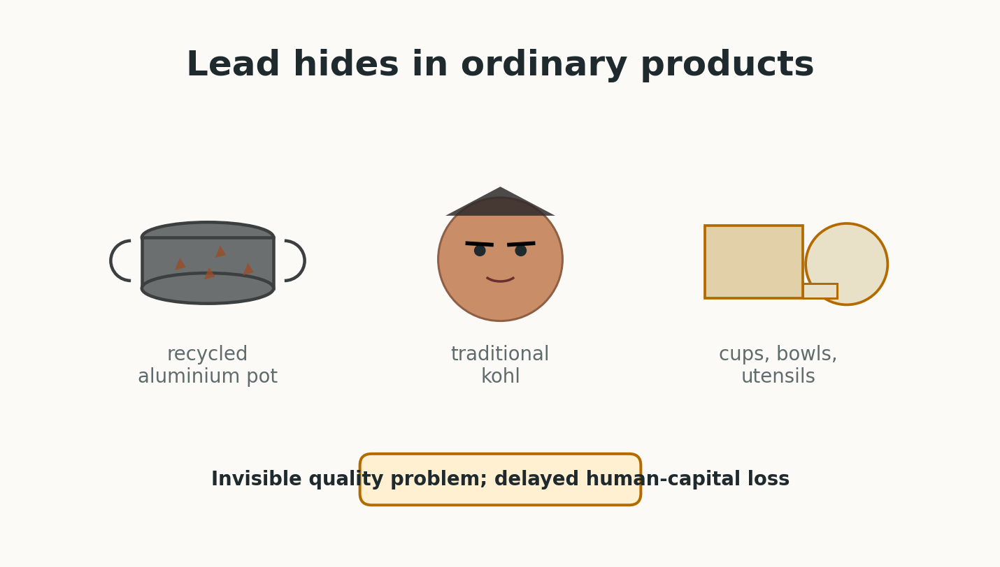
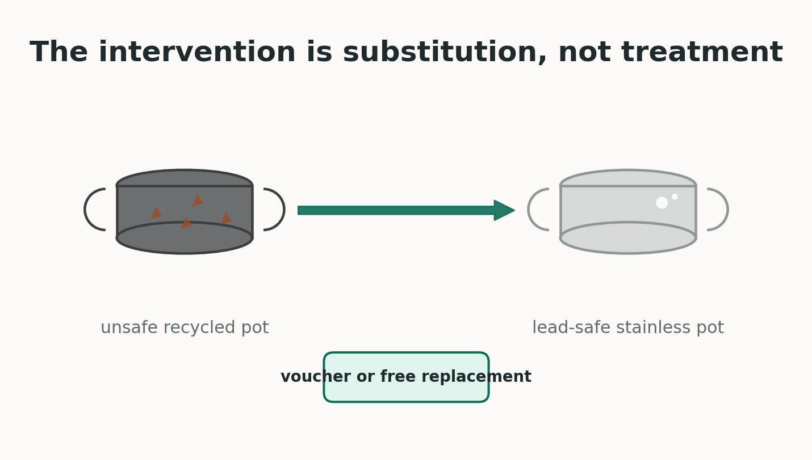
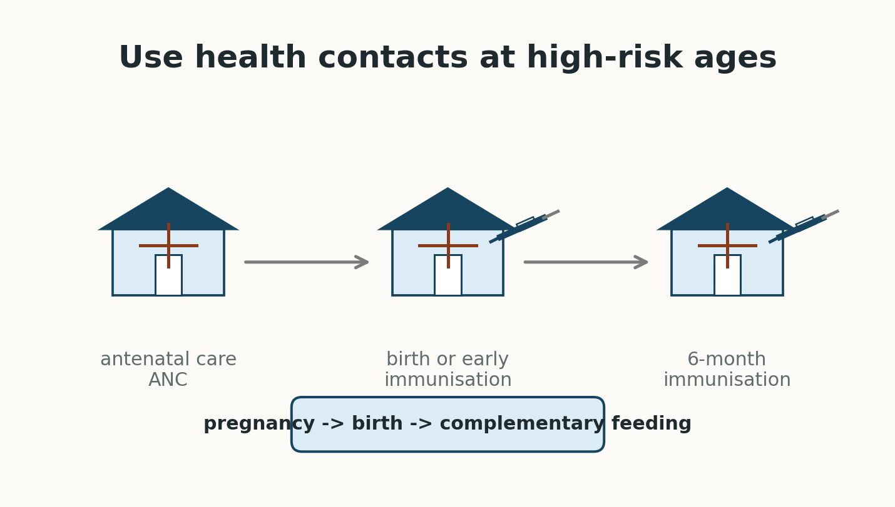
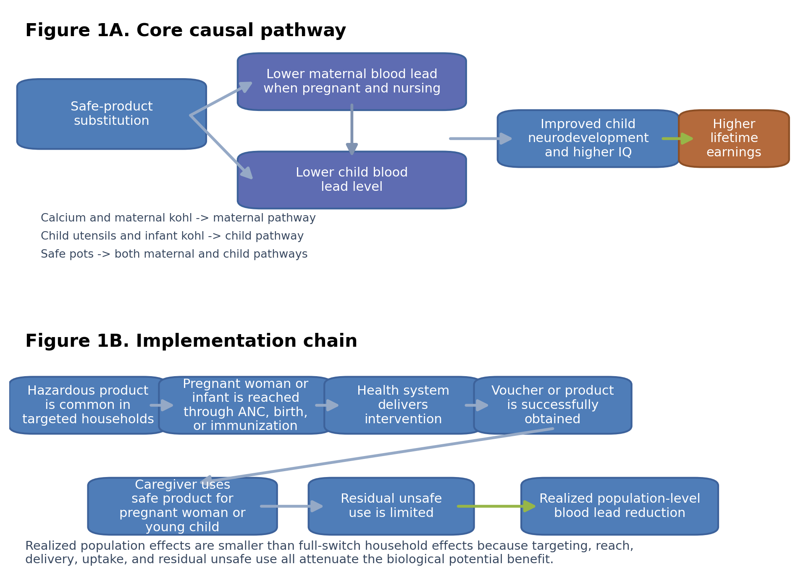
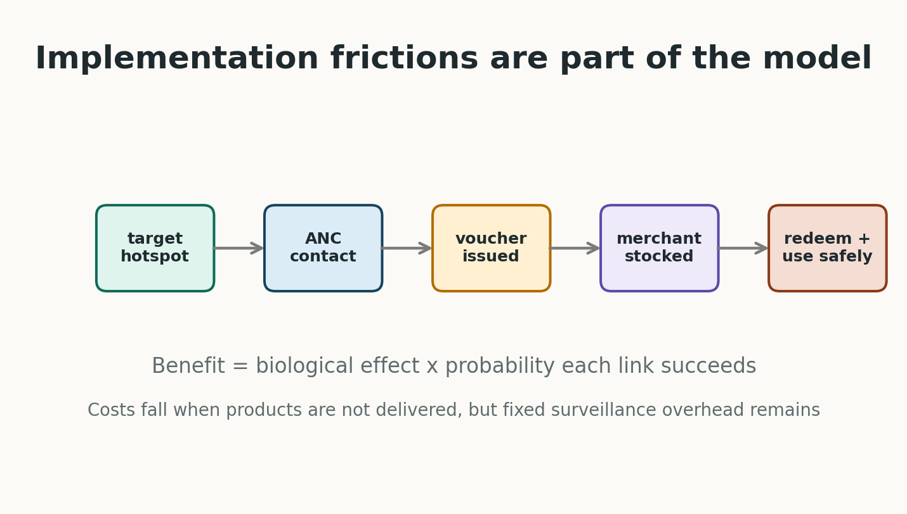
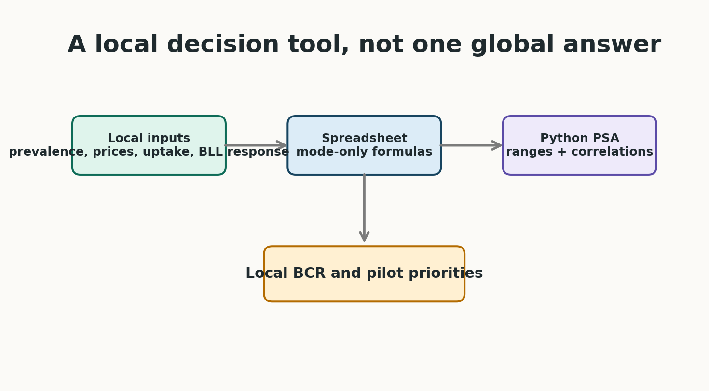
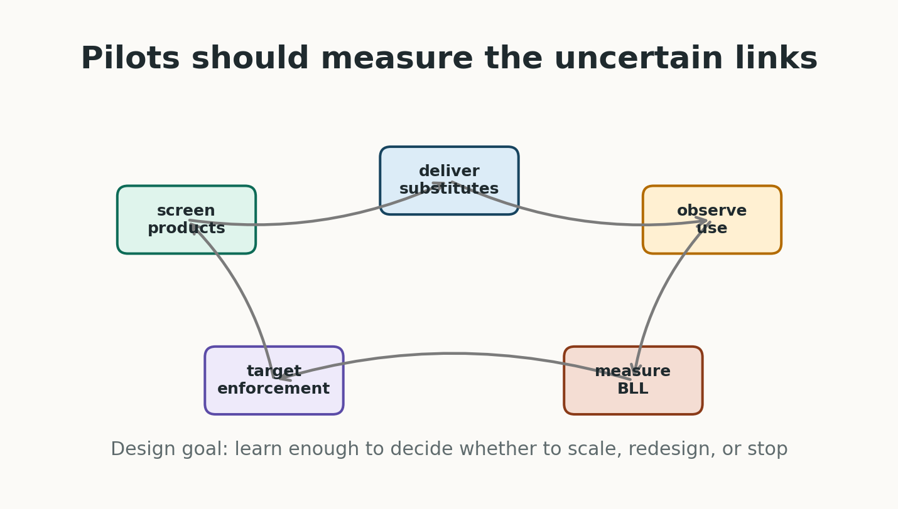

# Talk Roadmap

- Lead exposure: why economists should care
- Why informal consumer products create a policy problem
- The Sentinel Firewall idea
- Economic model and main assumptions
- Results and uncertainty
- What the tool lets ministries, NGOs and researchers do locally

# Why Lead Matters

- Lead is a neurotoxin with no known safe threshold for children.
- The biggest losses are often invisible: cognition, learning, behaviour, adult productivity.
- Adult cardiovascular disease is also important, but this talk focuses mainly on child cognition and earnings.
- Exposure during pregnancy and early childhood is especially damaging because the brain is developing rapidly.

# The Post-Gasoline Lead Problem

{width=62%}

- Rich countries largely reduced lead through gasoline, paint and formal-sector regulation.
- Many LMIC exposures now come from harder-to-regulate sources:
- artisanal aluminium cookware made from mixed scrap
- traditional cosmetics such as kohl, kajal or surma
- lead-contaminated ceramics, cups, bowls and utensils
- These products are ordinary household goods, not obvious "industrial pollution" to consumers.

# Why This Is an Economics Problem

- Households often cannot observe lead content or delayed cognitive harm.
- Informal producers may not internalise downstream health and productivity losses.
- Regulators may not know which products or supply chains are dangerous.
- The key market failure is not only pollution; it is hidden product quality plus delayed human-capital damage.

# Policy Gap

{width=60%}

- First-best policy: remove lead from products and supply chains.
- But enforcement and industrial upgrading can be slow.
- Pregnant women and infants are exposed now.
- Question: can health systems create a temporary consumer firewall while regulation catches up?

# Sentinel Firewall

{width=66%}

- Use sentinel screening to identify high-risk districts or catchments.
- Deploy modular safe-product packages through existing maternal and child health contacts.
- Use uptake, surrendered products and biomonitoring to inform enforcement.
- This is harm reduction, not a substitute for eliminating lead from production.

# Modelled Packages

- Kitchen Package:
- ANC voucher for a lead-safe cooking pot
- ANC calcium supplements
- safe child feeding utensils at immunisation
- Kohl Package:
- safe maternal kohl through ANC
- safe infant kohl through facility delivery or early-immunisation catch-up

# Pathway For The Kitchen Package

# Economic Model

- Unit: mother-child pair in a targeted high-risk setting.
- Costs: product costs, counselling, distribution, programme overhead and fixed screening cost per birth.
- Benefits: child IQ gains mapped to lifetime earnings; maternal/neonatal and adult CVD benefits are secondary extensions.
- Main output: benefit-cost ratio.

# Earnings Channel

- Present value of lifetime earnings:
- productivity = GDP PPP per capita x labour share of national income
- year-by-year survival from birth to adulthood and through working life
- real growth and social discounting
- Lead channel:
- lower BLL -> IQ gain -> higher lifetime earnings

# Why The Model Is Conservative In Spirit

{width=64%}

- It does not assume every targeted household benefits.
- Benefits are attenuated by:
- hazardous product prevalence
- ANC, delivery or immunisation contact
- health-system fidelity
- voucher issuance, merchant stock and redemption for pots
- caregiver adherence and residual unsafe use
- developmental timing: a one-year intervention does not equal lifelong exposure removal

# Main Results

# Result Magnitudes

- Kitchen Package cognition BCR:
- median 5.60
- 5th-95th percentile range 2.00 to 15.30
- 0.32% of simulations below parity
- Kohl Package cognition BCR:
- median 5.89
- 5th-95th percentile range 1.83 to 17.17
- 0.62% below parity

# Interpretation For Economists

- These are not universal LMIC estimates.
- They are a demonstration using plausible LMIC values in settings where the hazardous product is common.
- The high returns come from a large human-capital externality relative to low substitution costs.
- The uncertainty is real, but much of it is measurable in pilots.

# What Drives The Results?

- Product-specific BLL reduction: does the product really matter locally?
- Prevalence: are we targeting a true hotspot?
- Implementation: does the health system deliver and do households use the safe good?
- BLL-to-IQ and IQ-to-earnings parameters
- Discounting and local productivity

# Local Adaptation Tool

{width=66%}

- The Python model runs the full probabilistic sensitivity analysis.
- The Excel/Google Sheets version is a deterministic mode-only tool.
- Local users can change:
- product prevalence
- product prices
- attendance and fidelity
- redemption and use
- expected BLL response
- productivity and discounting

# What A Pilot Should Measure

{width=64%}

- Baseline product contamination and household use
- Voucher issuance and redemption
- Merchant stock and prices
- Sustained use by pregnant women and young children
- Residual use of unsafe products
- Measured child or maternal BLL response

# Contribution

- Reframes lead control as a targeted human-capital investment.
- Connects environmental health, maternal-child health platforms and benefit-cost analysis.
- Makes assumptions transparent enough to challenge.
- Provides code and spreadsheet tools so local teams can decide whether substitution is attractive in their own setting.

# Selected References

- Lanphear et al. 2005; Canfield et al. 2003; Jusko et al. 2008 on lead and cognition.
- Crawfurd et al. 2025 on lead and learning in developing countries.
- Ozawa et al. 2022; Grosse et al. 2002; Hanushek and Woessmann 2008 on cognition and earnings.
- Weidenhamer et al. 2014, 2023 and Sargsyan et al. 2024 on contaminated products.
- Larsen and Sanchez-Triana 2023 on global lead burden and costs.

# Discussion

- Where would substitution be most attractive?
- What parameter would you most want to identify causally?
- Should the first pilot randomise vouchers, prices or information?
- How should we value cognition gains in largely informal labour markets?
