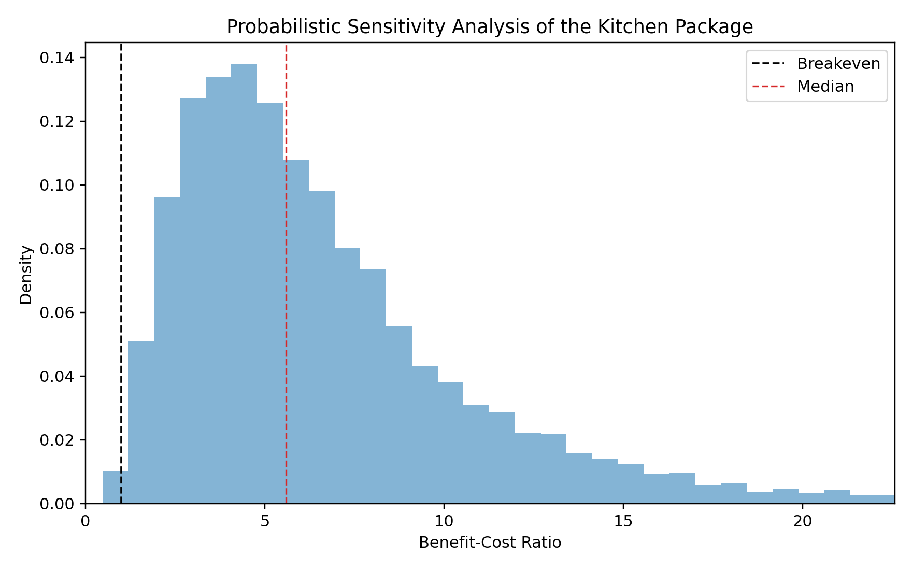
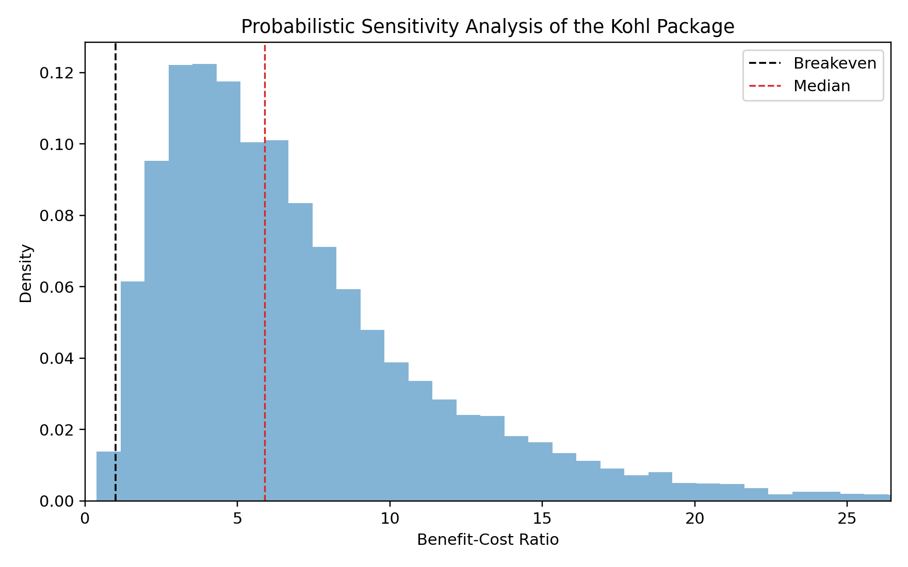
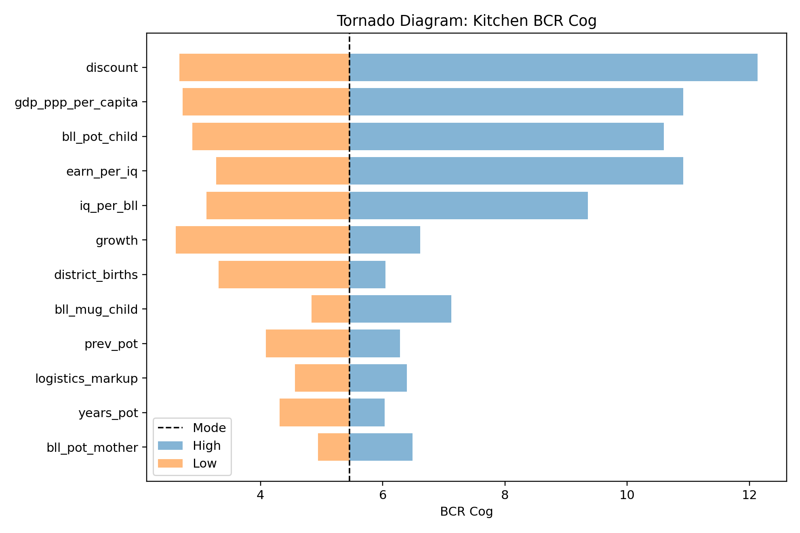
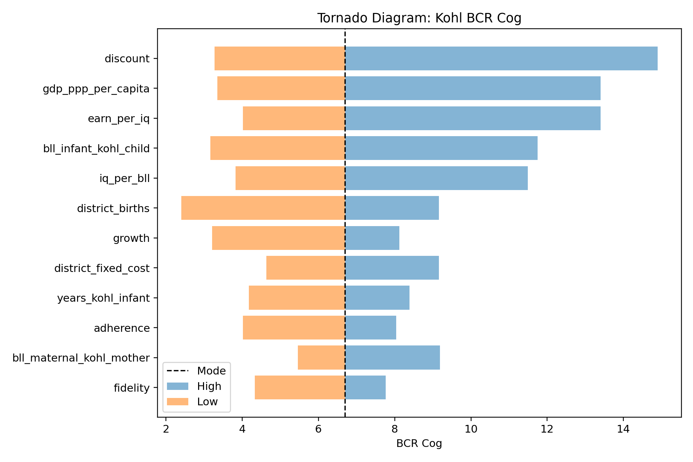

# Supplementary Figures

This supplementary file accompanies the manuscript "The Sentinel Firewall: A Health-System Strategy to Decouple Informal Industrialization from Lead Exposure in LMICs."

## Figure A1. Probabilistic sensitivity analysis of the Kitchen Package

Figure A1 shows the distribution of the cognition-channel benefit-cost ratio (BCR) for the Kitchen Package across 10 000 Monte Carlo draws. The vertical dashed line at BCR=1 marks parity: simulations to the right of this line produce benefits greater than costs. The second dashed line marks the median BCR. The x-axis is truncated at the 99th percentile for readability, so a small number of high-BCR simulations are not shown in the far right tail.

## Figure A2. Probabilistic sensitivity analysis of the Kohl Package

Figure A2 shows the distribution of the cognition-channel BCR for the Kohl Package across 10 000 Monte Carlo draws. As in Figure A1, the parity line marks BCR=1 and the median line marks the central simulation result. Compared with the Kitchen Package, the Kohl Package has a wider lower tail, reflecting greater sensitivity to local kohl use, infant reach, sex-specific practice and duration of substitute use. The x-axis is truncated at the 99th percentile for readability.

## Figure A3. Tornado diagram for Kitchen Package cognition-channel BCR

Figure A3 shows a one-way deterministic sensitivity analysis for the Kitchen Package. Each horizontal bar varies one parameter from its minimum to maximum value while holding all other parameters at their modal values. The dashed vertical line is the mode-based BCR. Longer bars identify parameters that have a larger effect on the cognition-channel BCR.

How to interpret the tornado diagram:

- The chart is not another Monte Carlo simulation. It changes one input at a time.
- Bars extending far to the left or right indicate parameters that strongly influence the BCR.
- The chart is useful for identifying which assumptions deserve the most scrutiny, but it does not show joint uncertainty or correlations among parameters.
- For the Kitchen Package, parameters related to the child BLL effect of the safe pot, the BLL-to-IQ relationship, earnings gains per IQ point, discounting and implementation success are expected to be among the most influential drivers.

Policy interpretation:

The Kitchen Package remains most sensitive to parameters governing biological efficacy and long-run valuation: how much the safe pot reduces child blood lead, how strongly blood lead affects cognition, how strongly cognition affects earnings and how heavily future earnings are discounted. Implementation parameters also matter, especially because the pot pathway requires voucher issuance, merchant stock, redemption and sustained targeted use.

## Figure A4. Tornado diagram for Kohl Package cognition-channel BCR

Figure A4 shows a one-way deterministic sensitivity analysis for the Kohl Package. Each horizontal bar varies one parameter from its minimum to maximum value while holding all other parameters at their modal values. The dashed vertical line is the mode-based BCR. Longer bars identify parameters that have a larger effect on the cognition-channel BCR.

How to interpret the tornado diagram:

- The chart isolates one parameter at a time; it does not show the combined effects of multiple parameters changing together.
- Wider bars indicate assumptions that drive more of the Kohl Package's economic case.
- The tornado diagram should be read alongside the Monte Carlo distribution in Figure A2, which incorporates joint uncertainty and the modelled positive dependence among implementation steps.

Policy interpretation:

The Kohl Package is especially sensitive to local practice: the prevalence of leaded maternal and infant kohl, whether infant kohl use affects boys as well as girls, the size of the infant kohl BLL effect and whether infants are reached through facility delivery or early-immunisation catch-up. The economic case is also sensitive to the same general valuation parameters as the Kitchen Package: the BLL-to-IQ relationship, earnings gains per IQ point and discounting.

## Notes on figure files

The PNG versions are intended for easy insertion into Word or Google Docs. The PDF versions are vector-style exports suitable for journal production if the submission system accepts PDF figure files.

Available files:

- `figure_a1_kitchen_bcr_distribution.png`
- `figure_a1_kitchen_bcr_distribution.pdf`
- `figure_a2_kohl_bcr_distribution.png`
- `figure_a2_kohl_bcr_distribution.pdf`
- `figure_a3_kitchen_tornado.png`
- `figure_a3_kitchen_tornado.pdf`
- `figure_a4_kohl_tornado.png`
- `figure_a4_kohl_tornado.pdf`
